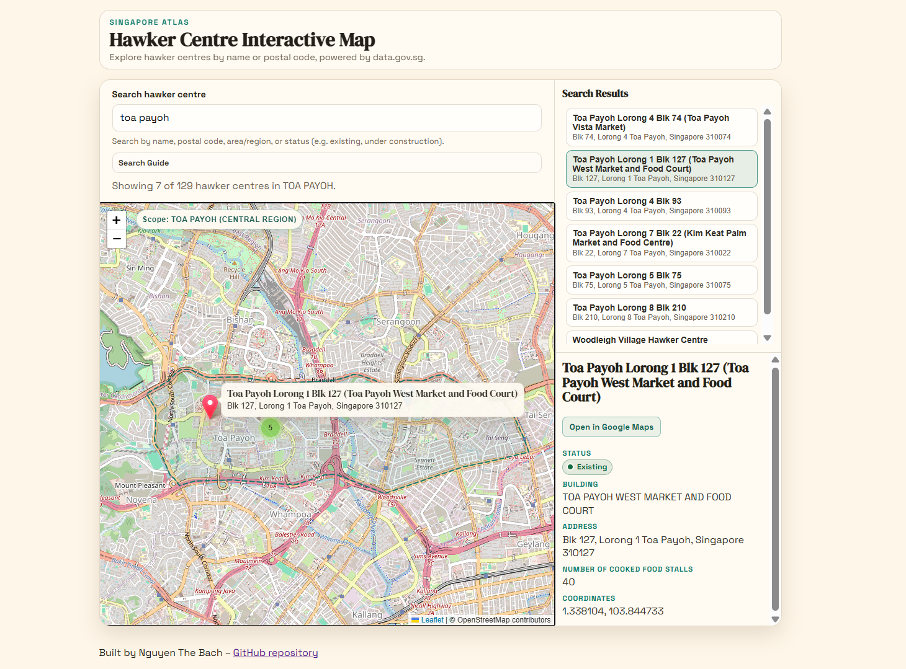

# Singapore Hawker Centre Interactive Map


## Overview

Interactive web map for Singapore hawker centres, backed by data.gov.sg GeoJSON data.

## Screenshot



### Approach and Architecture

- Frontend: plain ES modules + Leaflet + marker clustering.
- Backend proxy: `server.py` handles data.gov.sg poll-download handshake and serves `/api/hawker-centres`.
- State architecture: reducer-style state updates (`dispatch(action)`) in `src/state/store.js`.
- Search model:
  - local, client-side filtering after data load
  - supports name, postal code, address fields, status, and region/planning-area scope
  - supports combined scope + keyword queries (for example `central + maxwell`)
- UI model:
  - split right panel for search results + detail sheet
  - selection-driven marker/detail rendering
  - status chip with color coding in details

Detailed design notes are in [docs/ARCHITECTURE.md](docs/ARCHITECTURE.md).

## Setup Instructions

### Prerequisites

- Python 3.10+
- Node.js 18+ (for running tests)

### Install dependencies

This project intentionally uses minimal runtime dependencies.

```bash
npm install
```

### Configure environment

1. Copy `.env.example` to `.env.local`.
2. Optionally set your data.gov.sg API key:

```env
DATA_GOV_SG_API_KEY=your_key_here
```

### Run the app

```bash
python server.py
```

Open: `http://127.0.0.1:5173`

Notes:

- `server.py` is recommended because it proxies data.gov.sg and avoids browser CORS issues for temporary URLs.
- Do not expose your API key in frontend code.
- API key is optional: proxy requests work without it, but upstream data.gov.sg rate limits are lower without a key.

## Testing Instructions

Run all tests:

```bash
npm test
```

Current test coverage includes:

- query normalization (`src/utils/query.js`)
- reducer/filter behavior, including status filtering (`src/state/store.js`)
- scoped search parsing (`src/state/geoScope.js`)

## Assumptions / Challenges

- data.gov.sg rate limits apply to upstream requests made by this backend proxy; all users share that quota for this deployment.
- Region/area filtering is based on Master Plan 2019 data, which is stable for the foreseeable future, so the app uses local GeoJSON files instead of live API lookups.
- Running without an API key still works, but at a lower rate-limit tier than requests made with a key.
- The app uses in-memory fetch/filter (no database), so large dataset scaling is bounded by browser memory and CPU.
- UI split-panel sizing requires explicit sync logic because left and right panes are independent grid children.
- Status taxonomy may grow over time; unknown statuses are supported with a fallback style and filter match.

